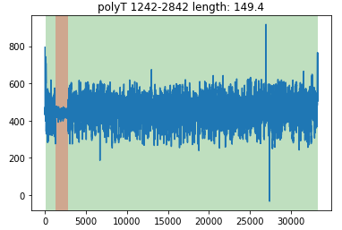
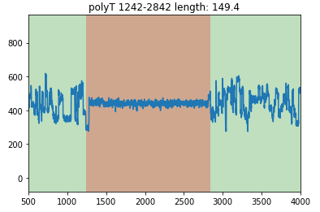
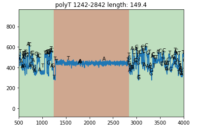
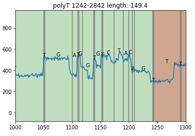

# PolyACaller

Predicate potential poly(A) regions from Nanopore fast5 file which has been basecalled by guppy with flipflop mode.

Maintained by Jinbu Jia, Weipeng Mo, Zhijian Liu.

## 1. For extract the best polyA region:
```
python polyAcaller.py test_data/test.fast5 test.out 
```

## 2. For extract all potential polyA region:
```
python polyAcaller.py test_data/test.fast5 test.out 0 #default 1
```

## 3. For extract the best polyA region in a specific region:

```
python polyAcaller.py test_data/test.fast5 test.out 0 test_data/test_sample2.search_region.txt
```

It's better to limit the polyA search region in a specific region. 
Such as the region between adapter and genome mapping region. It's
better to set some padding region, such as:
```

                    genome mapping region (|)      unmapping region (-)  3' adapter (*)
read: ---***----|||||||||||||||||||||||||||||||-------------------------***************----
search region:                       ||||||||||-------------------------*****
                                     |--10nt--|                         |5nt|
```

The next version will implemented adaper searching and genome mapping. But now
you can use minimap2 to perform genome mapping and use blastn or other tools to 
find adapter, and then set the search region based on the mapping information.

## 4. input file format

test_data/test_sample2.search_region.txt (tab sperated):
```
read_id 	base 	search_start_base 	search_end_base
000478c6-4c63-4cb7-baca-ca4954a12ee6 	A 	266 	274
```

## 5. output file format

```
read_id	read_length	polya_start	polya_end	polya_start_base	polya_end_base	polya_length	polya_score	polya_type
05c92581-89a8-4813-ac46-25ea1f00f6a2	2473	1242	2841	69	79	149.39605848696758	1555	polyT
05d86bb1-209a-4d1b-bd84-85853824a4a4	1232	1288	2965	63	72	140.56731451269684	1678	polyT
05e2c771-9cfe-4d04-95ec-3aae5f8cea67	1278	20864	22089	1207	1222	92.1577325939618	1226	polyA
```

## 6. polt

```
import polyAcaller
read = polyAcaller.Fast5ReadWrapper("example/test_sample1.fast5")
read.plot()
```

The cyan-blue region indicates the sequence region.
The grown region indicates the longer polyA region.



The parameters of plot method:
```
figsize = None #such as [10, 5]
plot_all_polyA_region=False 
plot_base=False
plot_base_line=False
xlim=None
ylim=None
```

You can set xlim to zoom in:
```
read.plot(xlim=[500,4000])
```




You can add the base sequence above the raw signal.
But this will be slower.
```
read.plot(xlim=[500,4000], plot_base=True)
```




You also can add the border line of bases.

```
read.plot(xlim=[1000,1300], plot_base=True, plot_base_line=True)
```



You can save the figure like this:

```
read.plot(xlim=[500,4000])
read.savefig("test_data/example.pdf")
```

Furthermore, the matplotlib object fig and ax has been 
stored in `read.fig`, `read.ax`.

## 7. The object of Fast5ReadWrapper


